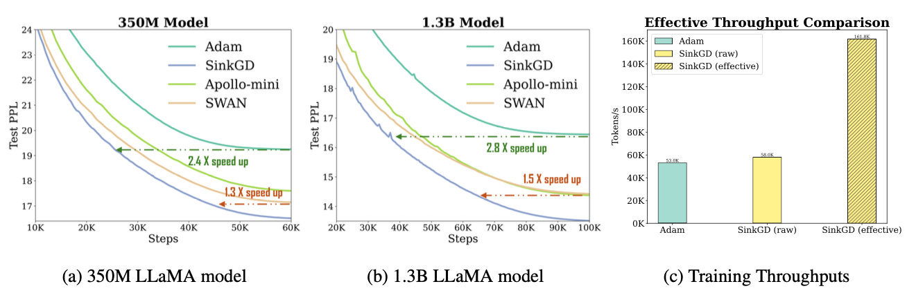

# SinkGD: A PyTorch Implementation

[](https://opensource.org/licenses/Apache-2.0)

SinkGD is a novel, stateless optimizer designed to significantly reduce the memory footprint of training Large Language Models (LLMs) while achieving exceptional performance.

This repository contains a PyTorch implementation of the **Sinkhorn Gradient Descent (SinkGD)** optimizer, as introduced in the paper:


> **Gradient Multi-Normalization for Stateless and Scalable LLM Training**
>  _Meyer Scetbon, Chao Ma, Wenbo Gong, Edward Meeds_
>
> [arXiv:2502.06742](https://arxiv.org/pdf/2502.06742)


## What is SinkGD?

Training modern LLMs is often bottlenecked by memory, largely due to stateful optimizers like Adam which store momentum estimates for every parameter. SinkGD tackles this problem by being completely **stateless**, achieving a memory footprint identical to simple SGD.

It is built on a novel framework called **Multi-Normalized Gradient Descent (MNGD)**, which aims to normalize gradients according to multiple mathematical norms simultaneously. The key innovation of SinkGD is its efficient procedure for this multi-normalization:

* For each gradient matrix, it **alternatively performs row-wise and column-wise $l_2$-normalization**.
* This elegant, alternating scheme has been mathematically shown to recover the iterates of the classic **Sinkhorn algorithm**.
* By relaxing the computationally expensive constraints of its predecessor (SWAN), SinkGD becomes a highly practical and scalable solution for large models.

The result is an optimizer that not only saves a massive amount of memory but also converges significantly faster in terms of wall-clock time.


## Key Features

This implementation provides:

* **High Performance:** Achieves up to a **3x effective throughput speedup** over AdamW in LLM pre-training, reaching target perplexity in a fraction of the time.
* **Memory Efficiency:** As a stateless optimizer, it dramatically reduces memory consumption, requiring the same memory as SGD and enabling the training of larger models on the same hardware.
* **Hybrid Optimizer Design:** Following the paper's methodology, this implementation makes it easy to apply SinkGD only to the 2D linear layers of a model, while using a standard normalization for other parameters (e.g., embeddings, layer norms).
* **Simple Integration:** Designed as a standard PyTorch optimizer class for easy, drop-in use in existing training scripts.


## Performance Highlights

SinkGD consistently outperforms AdamW and other memory-efficient baselines in LLM pre-training tasks.



- **Training Loss (Test Perplexity) vs. Steps**
As shown, SinkGD reaches the same test perplexity as Adam in far fewer steps, demonstrating a 2.4x - 2.8x speedup.

- **Effective Throughput Comparison**
While the raw step time is similar to Adam, the **effective throughput** (which accounts for faster convergence) is over 3x higher, leading to dramatic savings in total training time.


## Installation

```bash
pip install sinkgd-pytorch
```

## Quick Start

Using SinkGD is straightforward. The paper's authors achieved the best results by applying SinkGD **only to the 2D weight matrices** and using Adam for all other parameters (like embeddings and lyaer norms).

This implementation has simple branching logic inside that only apply SinkGD to 2-dim gradients and all other cases apply normalization only. So even by simply applying this optimizer alone can still work and it showed results on par with the authors' reported results.

Simple application with a single SinkGD optimizer:
```python
from sinkgd_optimizer import SinkGD

# ...

# --- Initialize optimizer ---
sinkgd_scaling = 0.05
global_lr = 2e-2
learning_rate = sinkgd_scaling * global_lr

optimizer = SinkGD(model.parameters(), lr=learning_rate, sinkhorn_iterations=5)

trainer = Trainer(
	model=model,
	optimizer=optimizer,
	# ...
)
# ...
```

However if you want to strictly reproduce as the paper suggests, here is an example of how to set up such parameter groups:

```python
from torch.optim import Adam
from sinkgd_optimizer import SinkGD
from transformers import AutoModelForCausalLM

model = AutoModelForCausalLM.from_pretrained("gpt2")

# 1. Create parameter groups
sinkgd_params = []
adam_params = []

for name, param in model.named_parameters():
    if param.requires_grad:
        # Apply SinkGD to 2D weight matrices of Linear layers
        if param.dim() == 2:
            sinkgd_params.append(param)
        # Apply Adam to all other parameters (biases, embeddings, layer norms)
        else:
            adam_params.append(param)

# 2. Initialize the optimizers for each group
# The paper uses a smaller, scaled learning rate for SinkGD layers
global_lr = 2e-2
sinkgd_scaling = 0.05

optimizer_groups = [
    {'params': adam_params, 'lr': global_lr},
    {'params': sinkgd_params, 'lr': global_lr * sinkgd_scaling}
]

# Note: The paper uses Adam for the non-SinkGD parameters.
# You can initialize Adam with the combined groups.
# The SinkGD logic will be handled internally based on the parameter groups.
# For a pure implementation, you might pass the SinkGD-specific parameters
# to your SinkGD class and the Adam parameters to torch.optim.Adam.

# The paper uses L=5 iterations for the Sinkhorn procedure
optimizer_sinkgd = SinkGD(sinkgd_params, lr=global_lr * sinkgd_scaling, sinkhorn_iterations=5)
optimizer_adam = Adam(adam_params, lr=global_lr)


# --- In your training loop ---
# optimizer.zero_grad() becomes:
optimizer_adam.zero_grad()
optimizer_sinkgd.zero_grad()

# loss.backward() ...

# optimizer.step() becomes:
optimizer_adam.step()
optimizer_sinkgd.step()
```


## Acknowledgements

This implementation is based entirely on the excellent work of the authors of SinkGD. All credit for the algorithm and its theoretical grounding goes to them. Please cite their original paper if you use this code in your research.

```bibtex
@article{scetbon2025gradient,
  title={Gradient Multi-Normalization for Stateless and Scalable LLM Training},
  author={Scetbon, Meyer and Ma, Chao and Gong, Wenbo and Meeds, Edward},
  archivePrefix={arXiv},
  primaryClass={cs.LG}
  url={https://arxiv.org/pdf/2502.06742}, 
  journal={arXiv preprint arXiv:2502.06742},
  year={2025}
}
```

## License

This project is licensed under **Apache 2.0 License**. See the `LICENSE` file for details.

## Contributing

Contributions are welcome! Please feel free to open an issue or submit a pull request.
